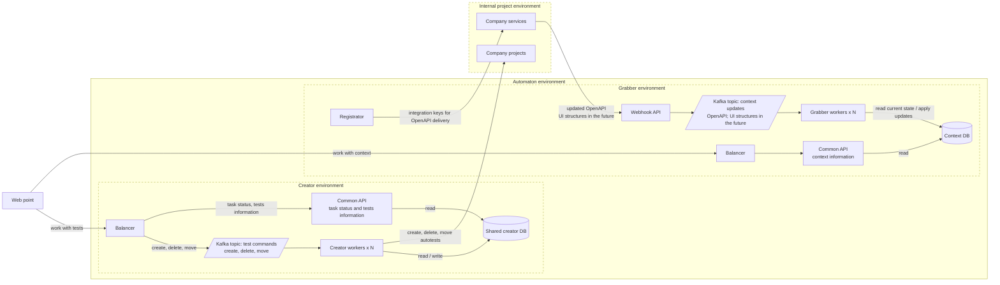

# SaaS infrastructure (Mermaid)

```mermaid
flowchart LR
    WebPoint["Web point"]

    subgraph Automaton["Automaton environment"]
        direction TB

        subgraph Creator["Creator environment"]
            direction TB
            CreatorBalancer["Balancer"]
            TestCommands[/"Kafka topic: test commands<br/>create, delete, move"/]
            CreatorWorkers["Creator workers x N"]
            CreatorApi["Common API<br/>task status and tests information"]
            CreatorDb[("Shared creator DB")]

            CreatorBalancer -- "create, delete, move" --> TestCommands
            CreatorBalancer -- "task status, tests information" --> CreatorApi
            TestCommands --> CreatorWorkers
            CreatorWorkers -- "read / write" --> CreatorDb
            CreatorApi -- "read" --> CreatorDb
        end

        subgraph Grabber["Grabber environment"]
            direction TB
            GrabberBalancer["Balancer"]
            GrabberApi["Common API<br/>context information"]
            ContextDb[("Context DB")]
            WebhookApi["Webhook API"]
            ContextUpdates[/"Kafka topic: context updates<br/>OpenAPI; UI structures in the future"/]
            GrabberWorkers["Grabber workers x N"]
            Registrator["Registrator"]

            GrabberBalancer --> GrabberApi
            GrabberApi -- "read" --> ContextDb
            WebhookApi --> ContextUpdates
            ContextUpdates --> GrabberWorkers
            GrabberWorkers -- "read current state / apply updates" --> ContextDb
        end
    end

    subgraph Internal["Internal project environment"]
        direction TB
        Projects["Company projects"]
        Services["Company services"]
    end

    WebPoint -- "work with tests" --> CreatorBalancer
    WebPoint -- "work with context" --> GrabberBalancer
    CreatorWorkers -- "create, delete, move autotests" --> Projects
    Services -- "updated OpenAPI<br/>UI structures in the future" --> WebhookApi
    Registrator -- "integration keys for OpenAPI delivery" --> Services

    style Creator stroke-dasharray: 5 5
    style Grabber stroke-dasharray: 5 5
    style Internal stroke-dasharray: 5 5
```
